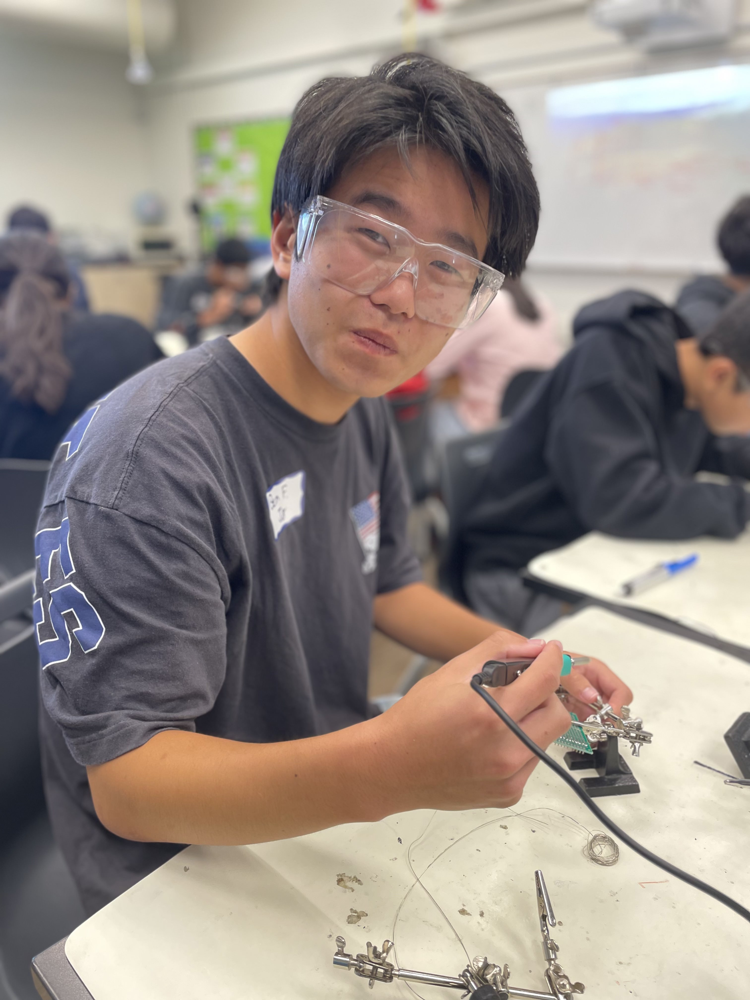
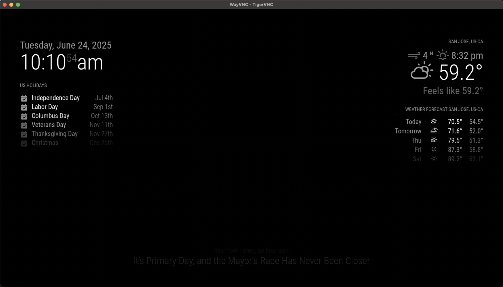
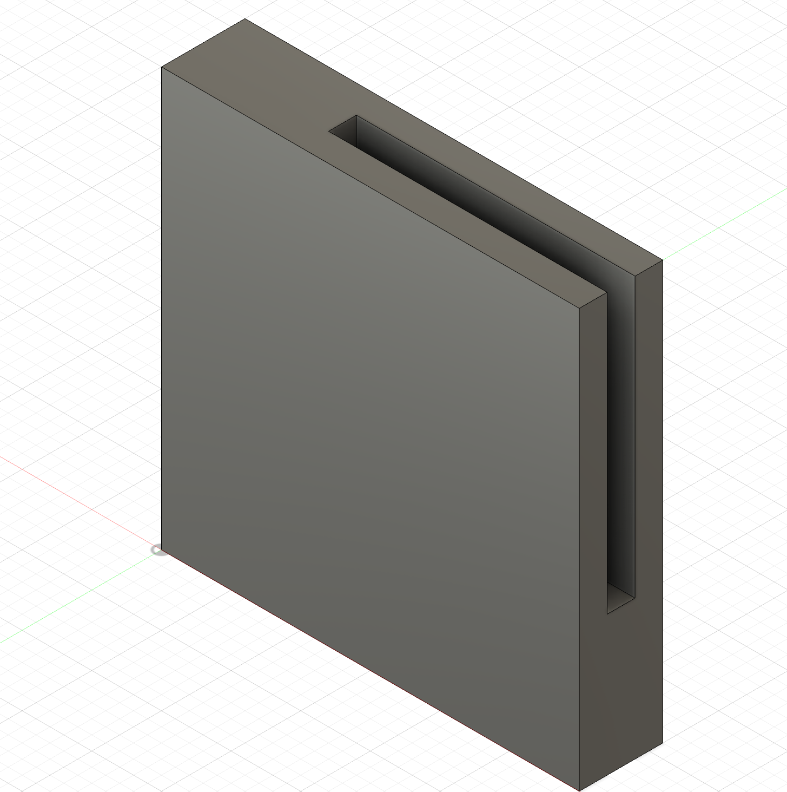
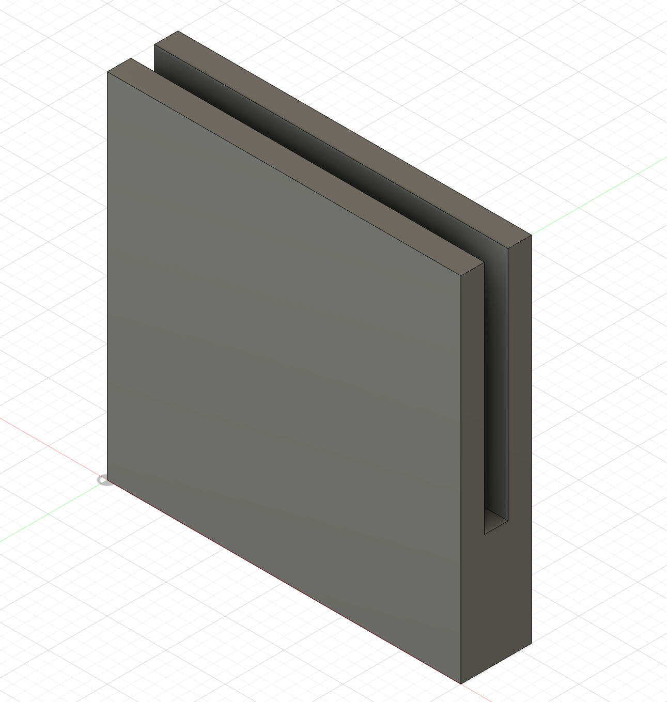
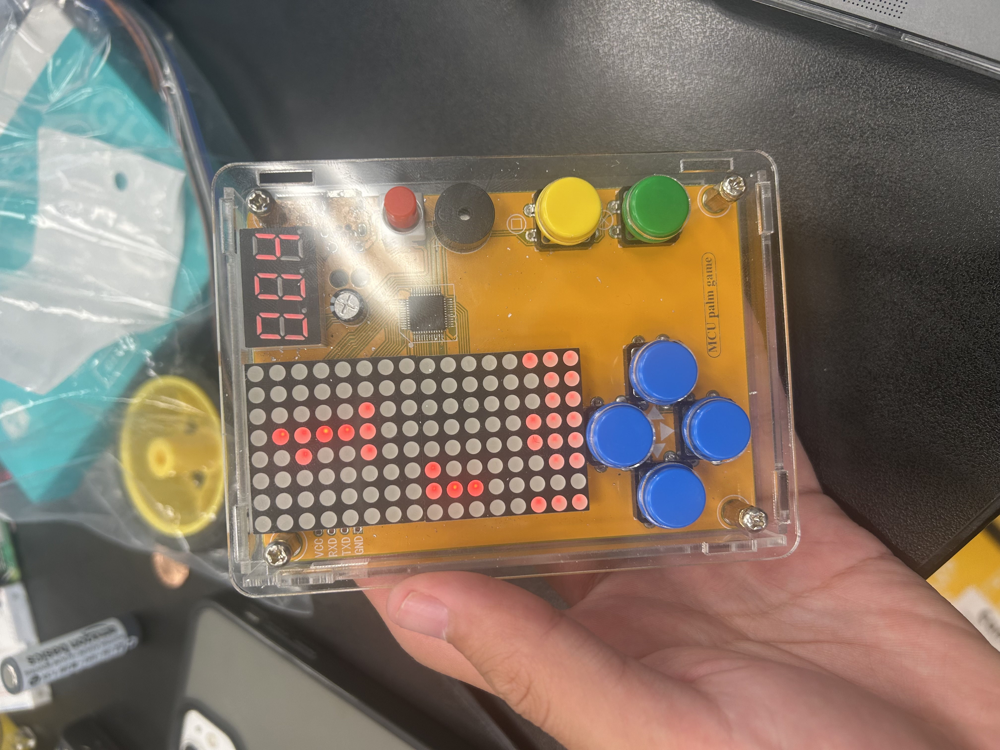

# Smart Mirror
For my project I am building a smart mirror than runs using a Raspberry Pi. The mirror displays information like time, weather, and news to the user.

You should comment out all portions of your portfolio that you have not completed yet, as well as any instructions:
```HTML 
<!--- This is an HTML comment in Markdown -->
<!--- Anything between these symbols will not render on the published site -->
```

| **Engineer** | **School** | **Area of Interest** | **Grade** |
|:--:|:--:|:--:|:--:|
| Ben F | Homestead | Mechanical Engineering | Incoming Junior

**Replace the BlueStamp logo below with an image of yourself and your completed project. Follow the guide [here](https://tomcam.github.io/least-github-pages/adding-images-github-pages-site.html) if you need help.**


  

<!--- # Final Milestone

**Don't forget to replace the text below with the embedding for your milestone video. Go to Youtube, click Share -> Embed, and copy and paste the code to replace what's below.**

<iframe width="560" height="315" src="https://www.youtube.com/embed/F7M7imOVGug" title="YouTube video player" frameborder="0" allow="accelerometer; autoplay; clipboard-write; encrypted-media; gyroscope; picture-in-picture; web-share" allowfullscreen></iframe>

For your final milestone, explain the outcome of your project. Key details to include are:
- What you've accomplished since your previous milestone
- What your biggest challenges and triumphs were at BSE
- A summary of key topics you learned about
- What you hope to learn in the future after everything you've learned at BSE

For my last milestone, I was able to design assemble my Smart Mirror. To do this I first examined the mirror frame I was given and the monitor I was given. When examining these parts I realized that there was no way to be able to fit the monitor in the the frame without modifications. To fit the montior, I first drilled holes into plywood to match the four mounting screws that the monitor had. Then using these holes I screwed the monitor into the the plywood. I then cut out two slices of plywood to the right and left of the monitor so that the IO ports and the buttons to adjust the monitor could be accessed and not trapped behind the plywood when the mirror was fully assembled. After doing that, since the monitor and plywood were thicker than the mirror something would be needed to mount the plywood a little bit behind the frame of the mirror. To solve this problem I used CAD to design two types of mounting brackets (Figures 1 and 2 in Schematics). These brackets would hold the plywood slightly behind the frame so that the monitor could fit. However, when a went to drill the brackets into the frame, I realized that the frame was too brittle and that I needed to make a new frame. So I decided to make a new frame out of wood.
--->


# Second Milestone

<!---<iframe width="560" height="315" src="https://www.youtube.com/embed/y3VAmNlER5Y" title="YouTube video player" frameborder="0" allow="accelerometer; autoplay; clipboard-write; encrypted-media; gyroscope; picture-in-picture; web-share" allowfullscreen></iframe>-->

For my second milestone, I was able to get the Magic Mirror code running on my Raspberry Pi. To do this I followed the documentation for the Magic Mirror. First downloading Node onto the Raspberry Pi. Then, I cloned the Magic Mirror repository onto the Pi and entering it with the cd command. However, when I went to install the program it gave me an error stating that my Node version was not correct. I then went online to find out how to update my Node version to the correct version. I followed the online instructions to update it. After that, The program was able to be installed onto the Pi. I then ran the program on the Pi to find out that I would like to change how it is configured to give me the correct weather and time for San Jose. I went back into the documentation to find out how to change these and used Visual Studio Code to edit the code so that it would display the correct information. Before I complete my final milestone, I need to assemble my mirror, connect it to the Raspberry Pi, and make sure that the code runs without problems on it.


Magic Mirror Code running on the Raspberry Pi viewed through Tiger VNC


# First Milestone

<iframe width="560" height="315" src="https://www.youtube.com/embed/lR03E-XPhus?si=wNX5nMR3U7F3m0Tk" title="YouTube video player" frameborder="0" allow="accelerometer; autoplay; clipboard-write; encrypted-media; gyroscope; picture-in-picture; web-share" referrerpolicy="strict-origin-when-cross-origin" allowfullscreen></iframe>

My project is a smart mirror that runs on Raspberry Pi which runs the code to display time, weather, and news. At this milestone, I was able to get the Raspberry Pi running. To get it to run, I first connected it to a capture card which streamed the screen output of the Raspberry Pi to my laptop using OBS, a streaming software which lets me stream the Pi to my computer. With this, I was able to change the settings of the Pi so that ssh could be used. We use ssh so that we can work on the Raspberry Pi while still using our computer. After doing that, I returned to my laptop and pinged the Pi in the Terminal and then used the ssh command to connect to it. Then, I used Tiger VNC to remotely view and control my Raspberry Pi without needing to use the capture card. Finally, I installed Visual Studio Code to code on my computer and send it to the Raspberry Pi. A challenge I faced was that I had forgotten the password to my Raspberry Pi so I needed assistance to reset it. I plan to complete the project by first coding the Raspberry Pi and then assembling my mirror.


Raspberry Pi being accessed and controled from my computer

# Schematics 
<!---Here's where you'll put images of your schematics. [Tinkercad](https://www.tinkercad.com/blog/official-guide-to-tinkercad-circuits) and [Fritzing](https://fritzing.org/learning/) are both great resoruces to create professional schematic diagrams, though BSE recommends Tinkercad becuase it can be done easily and for free in the browser.--->

Figure 1 & 2: Corner & Side Mounting Bracket

 

Figures 1 & 2:
The thickness of the monitor attached to the plywood backboard is greater than that of the frame. So I had to design some brackets to mount the backboard montior assembly to be back of the frame. Both types of brackets are 3cm by 3cm squares that are 0.6cm thick. There is a 0.2cm cut into the brackets for the plywood to slide into. The cut leaves 1cm where the brackets would overlap with the frame to allow for mounting the brackets to the frame with a screw.


<!---# Code
Here's where you'll put your code. The syntax below places it into a block of code. Follow the guide [here]([url](https://www.markdownguide.org/extended-syntax/)) to learn how to customize it to your project needs. 

```c++
void setup() {
  // put your setup code here, to run once:
  Serial.begin(9600);
  Serial.println("Hello World!");
}

void loop() {
  // put your main code here, to run repeatedly:

}
```

# Bill of Materials
Here's where you'll list the parts in your project. To add more rows, just copy and paste the example rows below.
Don't forget to place the link of where to buy each component inside the quotation marks in the corresponding row after href =. Follow the guide [here]([url](https://www.markdownguide.org/extended-syntax/)) to learn how to customize this to your project needs. 

| **Part** | **Note** | **Price** | **Link** |
|:--:|:--:|:--:|:--:|
| Item Name | What the item is used for | $Price | <a href="https://www.amazon.com/Arduino-A000066-ARDUINO-UNO-R3/dp/B008GRTSV6/"> Link </a> |
| Item Name | What the item is used for | $Price | <a href="https://www.amazon.com/Arduino-A000066-ARDUINO-UNO-R3/dp/B008GRTSV6/"> Link </a> |
| Item Name | What the item is used for | $Price | <a href="https://www.amazon.com/Arduino-A000066-ARDUINO-UNO-R3/dp/B008GRTSV6/"> Link </a> |
--->
# Starter Project

<iframe width="560" height="315" src="https://www.youtube.com/embed/HlC0FD95Rxc?si=TMSMpwka0znPHmGE" title="YouTube video player" frameborder="0" allow="accelerometer; autoplay; clipboard-write; encrypted-media; gyroscope; picture-in-picture; web-share" referrerpolicy="strict-origin-when-cross-origin" allowfullscreen></iframe>

For my starter project I made a retro arcade console which plays Tetris. It works by connecting components with a circuit board. These components are buttons, a screen, an on off toggle, and a battery pack. To attach these components onto the main board, I used a soldering iron to solder the components on. Some challenges that I faced while making this learning how to soder and sodering on the USB port the wrong way around.




