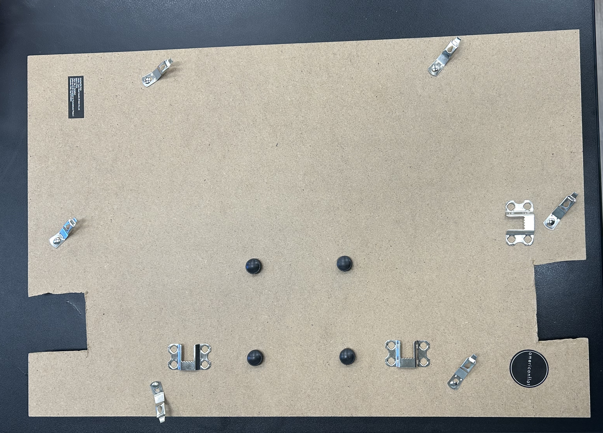
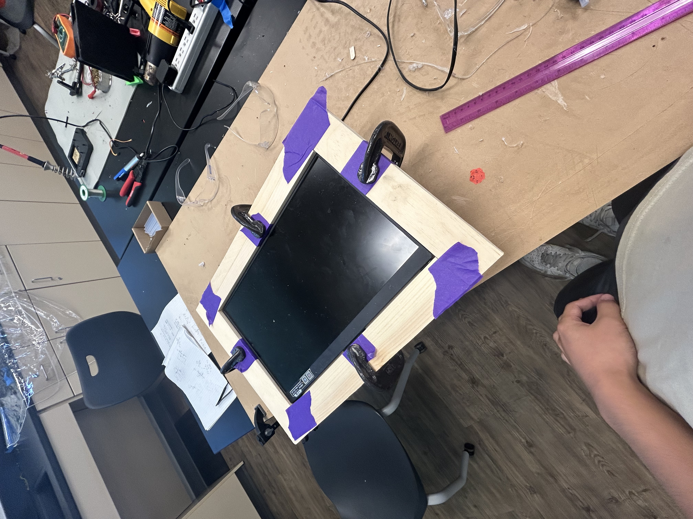
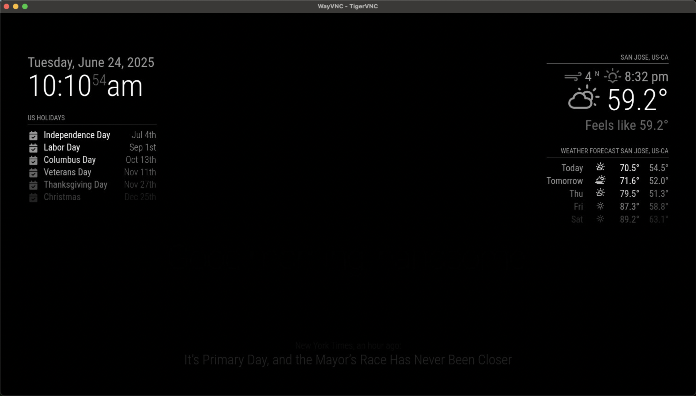
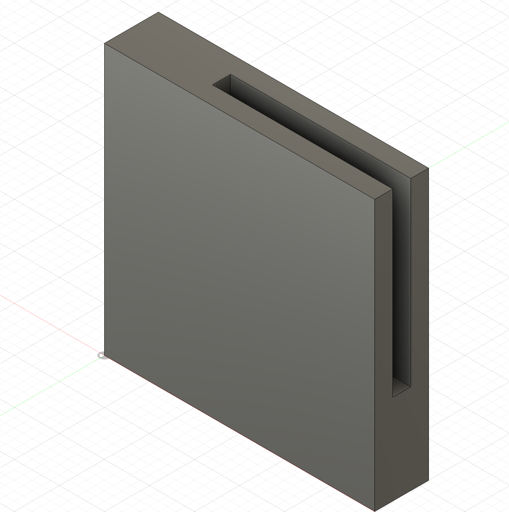
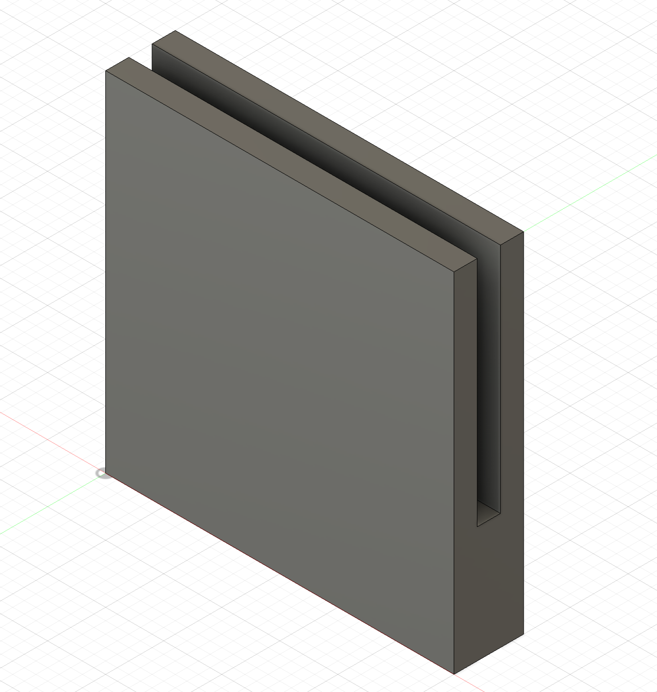
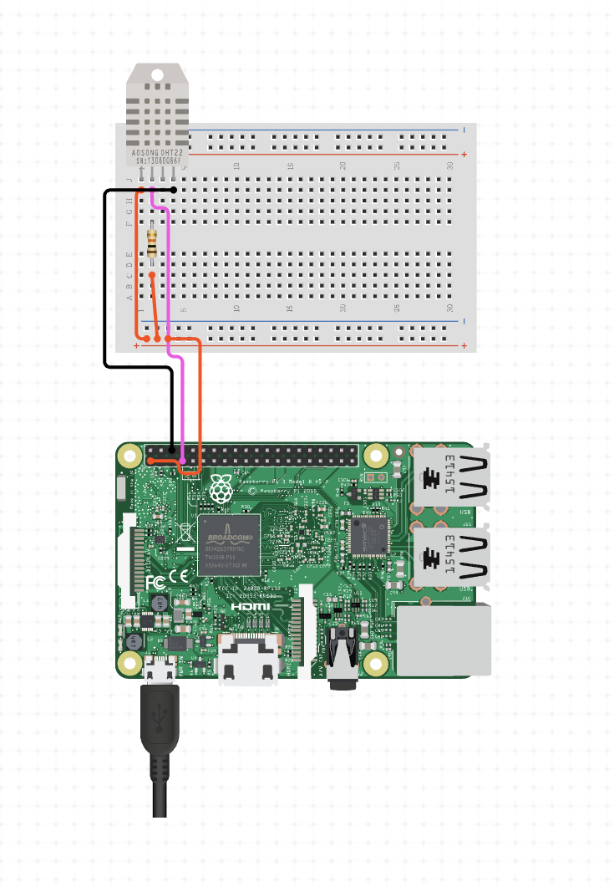
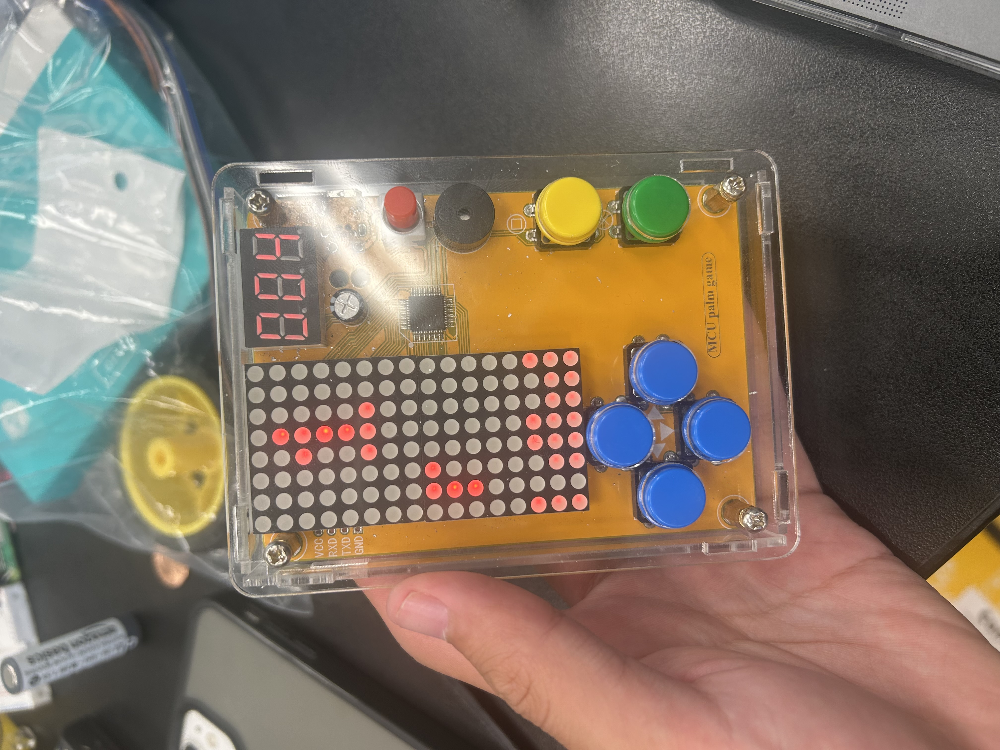

# Smart Mirror
For my project I am building a smart mirror than runs using a Raspberry Pi. The mirror displays information like time, weather, and news to the user. The mirror runs software that allows for modules to be displayed onto the Magic Mirror. These modules use APIs to recieve the information that is displayed and can be downloaded off the internet.

| **Engineer** | **School** | **Area of Interest** | **Grade** |
|:--:|:--:|:--:|:--:|
| Ben F | Homestead | Mechanical Engineering | Incoming Junior


  

# Final Milestone

<!--- <iframe width="560" height="315" src="https://www.youtube.com/embed/F7M7imOVGug" title="YouTube video player" frameborder="0" allow="accelerometer; autoplay; clipboard-write; encrypted-media; gyroscope; picture-in-picture; web-share" allowfullscreen></iframe>--->

For my last milestone, I was able to design assemble my Smart Mirror. To do this I first examined the mirror frame I was given and the monitor I was given. When examining these parts I realized that there was no way to be able to fit the monitor in the the frame without modifications. To fit the montior, I first drilled holes into plywood to match the four mounting screws that the monitor had. Then using these holes I screwed the monitor into the the plywood. I then cut out two slices of plywood to the right and left of the monitor so that the IO ports and the buttons to adjust the monitor could be accessed and not trapped behind the plywood when the mirror was fully assembled. After doing that, since the monitor and plywood were thicker than the mirror something would be needed to mount the plywood a little bit behind the frame of the mirror. To solve this problem I used CAD to design two types of mounting brackets. (Figures 1 & 2)



However, when I tried to assemble this I found out that the frame was to brittle to hold the screws in meaning that I would have to find a new way to assemble my mirror. So I decided to make my own frame using wood. I decided that the mirror would have a 2 inch thick frame and be around 1 inch thick. The frame would be made out of pine wood that I would cut and it would be backed by a large sheet of plywood to hold it together. I cut the wood from a large plank into some smaller 1x2 planks using a jigsaw, then using the same jigsaw I cut two divots into the top and bottom so that IO could be accessed. Then I used sandpaper to smooth out the divots. After that I used wood glue to connect the 1x2 planks to the plywood backboard. 




# Second Milestone

<iframe width="560" height="315" src="https://www.youtube.com/embed/y3VAmNlER5Y" title="YouTube video player" frameborder="0" allow="accelerometer; autoplay; clipboard-write; encrypted-media; gyroscope; picture-in-picture; web-share" allowfullscreen></iframe>

For my second milestone, I was able to get the Magic Mirror code running on my Raspberry Pi. To do this I followed the documentation for the Magic Mirror. First downloading Node onto the Raspberry Pi. Then, I cloned the Magic Mirror repository onto the Pi and entering it with the cd command. However, when I went to install the program it gave me an error stating that my Node version was not correct. I then went online to find out how to update my Node version to the correct version. I followed the online instructions to update it. After that, The program was able to be installed onto the Pi. I then ran the program on the Pi to find out that I would like to change how it is configured to give me the correct weather and time for San Jose. I went back into the documentation to find out how to change these and used Visual Studio Code to edit the code so that it would display the correct information. Before I complete my final milestone, I need to assemble my mirror, connect it to the Raspberry Pi, and make sure that the code runs without problems on it.


Magic Mirror Code running on the Raspberry Pi viewed through Tiger VNC


# First Milestone

<iframe width="560" height="315" src="https://www.youtube.com/embed/lR03E-XPhus?si=wNX5nMR3U7F3m0Tk" title="YouTube video player" frameborder="0" allow="accelerometer; autoplay; clipboard-write; encrypted-media; gyroscope; picture-in-picture; web-share" referrerpolicy="strict-origin-when-cross-origin" allowfullscreen></iframe>

My project is a smart mirror that runs on Raspberry Pi which runs the code to display time, weather, and news. At this milestone, I was able to get the Raspberry Pi running. To get it to run, I first connected it to a capture card which streamed the screen output of the Raspberry Pi to my laptop using OBS, a streaming software which lets me stream the Pi to my computer. With this, I was able to change the settings of the Pi so that ssh could be used. We use ssh so that we can work on the Raspberry Pi while still using our computer. After doing that, I returned to my laptop and pinged the Pi in the Terminal and then used the ssh command to connect to it. Then, I used Tiger VNC to remotely view and control my Raspberry Pi without needing to use the capture card. Finally, I installed Visual Studio Code to code on my computer and send it to the Raspberry Pi. A challenge I faced was that I had forgotten the password to my Raspberry Pi so I needed assistance to reset it. I plan to complete the project by first coding the Raspberry Pi and then assembling my mirror.


Raspberry Pi being accessed and controled from my computer

# Schematics 

Figure 1 & 2: Corner & Side Mounting Bracket

 

Figures 1 & 2:
The thickness of the monitor attached to the plywood backboard is greater than that of the frame. So I had to design some brackets to mount the backboard montior assembly to be back of the frame. Both types of brackets are 3cm by 3cm squares that are 0.6cm thick. There is a 0.2cm cut into the brackets for the plywood to slide into. The cut leaves 1cm where the brackets would overlap with the frame to allow for mounting the brackets to the frame with a screw.

Figure 3: DHT11 Temperature Sensor wiring diagram




# Code

This is how I have configured my MagicMirror:
```js
et config = {
	address: "localhost",	// Address to listen on, can be:
							// - "localhost", "127.0.0.1", "::1" to listen on loopback interface
							// - another specific IPv4/6 to listen on a specific interface
							// - "0.0.0.0", "::" to listen on any interface
							// Default, when address config is left out or empty, is "localhost"
	port: 8080,
	basePath: "/",	// The URL path where MagicMirror² is hosted. If you are using a Reverse proxy
									// you must set the sub path here. basePath must end with a /
	ipWhitelist: ["127.0.0.1", "::ffff:127.0.0.1", "::1"],	// Set [] to allow all IP addresses
									// or add a specific IPv4 of 192.168.1.5 :
									// ["127.0.0.1", "::ffff:127.0.0.1", "::1", "::ffff:192.168.1.5"],
									// or IPv4 range of 192.168.3.0 --> 192.168.3.15 use CIDR format :
									// ["127.0.0.1", "::ffff:127.0.0.1", "::1", "::ffff:192.168.3.0/28"],

	useHttps: false,			// Support HTTPS or not, default "false" will use HTTP
	httpsPrivateKey: "",	// HTTPS private key path, only require when useHttps is true
	httpsCertificate: "",	// HTTPS Certificate path, only require when useHttps is true

	language: "en",
	locale: "en-US",   // this variable is provided as a consistent location
			   // it is currently only used by 3rd party modules. no MagicMirror code uses this value
			   // as we have no usage, we  have no constraints on what this field holds
			   // see https://en.wikipedia.org/wiki/Locale_(computer_software) for the possibilities

	logLevel: ["INFO", "LOG", "WARN", "ERROR"], // Add "DEBUG" for even more logging
	timeFormat: 12,
	units: "imperial",

	modules: [
		{
			module: "alert",
		},
		{
			module: "clock",
			position: "top_bar",
			config: {
				timeFormat: "12",
				timezone: "America/Los_Angeles"
			},
		},
		{
			module: "weather",
			position: "top_right",
			config: {
				weatherProvider: "weathergov",
				type: "current",
				lat: 37.3688,
				lon: -122.0363,
				showIndoorTemperature: true,
				showIndoorHumidity: true,
			}
		},
		{
			module: "weather",
			position: "top_right",
			header: "Weather Forecast",
			config: {
				weatherProvider: "weathergov",
				type: "forecast",
				lat: 37.3688,
				lon: -122.0363
			}
		},
		{
			module: "newsfeed",
			position: "bottom_bar",
			config: {
				feeds: [
					{
						title: "New York Times",
						url: "https://rss.nytimes.com/services/xml/rss/nyt/HomePage.xml",
						broadcastNewsFeeds: true,
					}
				],
				showSourceTitle: true,
				showPublishDate: true,
				broadcastNewsFeeds: true,
				broadcastNewsUpdates: true
			}
		},
		{
			module: "MMM-MyScoreboard",
			position: "top_left",
			classes: "default everyone",
			header: "Sports",
			config: {
				showLeagueSeparators: true,
				colored: true,
				viewStyle: "largeLogos",
				sports: [
				{
					league: "NBA",
					teams: ["GSW"],
					groups: ["West"]
				},
				{
					league: "MLB",
					teams: ["SF"]
				},
				{
					league: "NFL",
					teams: ["SF"],
					groups: ["NFC West"]
				}
				]

			}
		},
		{
			module: "MMM-DHT-Sensor",
			config:{
				sensorPin: 2,
				sensorType: 11,
				units: "imperial",
				updateInterval: 0.5,
			}
		},
	]
};

<!---/*************** DO NOT EDIT THE LINE BELOW ***************/
if (typeof module !== "undefined") { module.exports = config; }
```
Downloading MagicMirrorOS:
1. Download Node.js
2. Execute ```git``` to check if git is install, install it if it isn't already
3. Clone the MagicMirror repostitory by running ```git clone https://github.com/MagicMirrorOrg/MagicMirror```
4. Enter the MagicMirror respostory with ```cd MagicMirror```
5. Install MagicMirrorOS with ```npm run install-mm```
6. Copy the config sample file ```cp config/config.js.sample config/config.js```
7. Start MagicMirrorOS with ```npm run start```

Custom Modules I installed:

<a href="https://github.com/dathbe/MMM-MyScoreboard"> MMM-MyScoreboard </a>

<a href="https://github.com/glitch452/MMM-LocalTemperature"> MMM-LocalTemperature </a>

# Bill of Materials

| **Part** | **Note** | **Price** | **Link** |
|:--:|:--:|:--:|:--:|
|CanaKit Raspberry Pi 4 4GB Starter PRO Kit | Running MagicMirrorOS | $139.99 | <a href="https://a.co/d/fWeGlak"> Link </a> |
| 15.6’’ FHD IPS Portable Monitor | Displays MagicMirrorOS to the user | $81.99 | <a href="https://a.co/d/0VFRcFx"> Link </a> |
| Anker New Nylon USB C to USB C Cable (6ft 60W, 2-Pack) | Cables to power the Raspberry Pi and Monitor | $12.99 | <a href="https://a.co/d/dEYt4i2"> Link </a> |
| Nekmit Dual Port USB C Wall Charger, 40W PD | Powers Raspberry Pi and Monitor | $26.99 | <a href="https://a.co/d/g5ZpG17"> Link </a> |
| 12 x 18 x 0.04 Inch Acrylic See-Through Mirror | Shows a reflection while letting light pass through | $29.99 | <a href="https://a.co/d/3HWUPE6"> Link </a> |
| 6 Pack Basswood Sheets for Crafts 1/8x12x18 | Backboard for the mirror assembly | $19.99 | <a href="https://a.co/d/7VZWMLw"> Link </a> |
| Edge-glued Board by Walnut Hollow, Pine, 12" x 16" x 3/4" | Wood to assemble frame with | $19.50 | <a href="https://a.co/d/bsTsKR3"> Link </a> |

# Starter Project

<iframe width="560" height="315" src="https://www.youtube.com/embed/HlC0FD95Rxc?si=TMSMpwka0znPHmGE" title="YouTube video player" frameborder="0" allow="accelerometer; autoplay; clipboard-write; encrypted-media; gyroscope; picture-in-picture; web-share" referrerpolicy="strict-origin-when-cross-origin" allowfullscreen></iframe>

For my starter project I made a retro arcade console which plays Tetris. It works by connecting components with a circuit board. These components are buttons, a screen, an on off toggle, and a battery pack. To attach these components onto the main board, I used a soldering iron to solder the components on. Some challenges that I faced while making this learning how to soder and sodering on the USB port the wrong way around.




