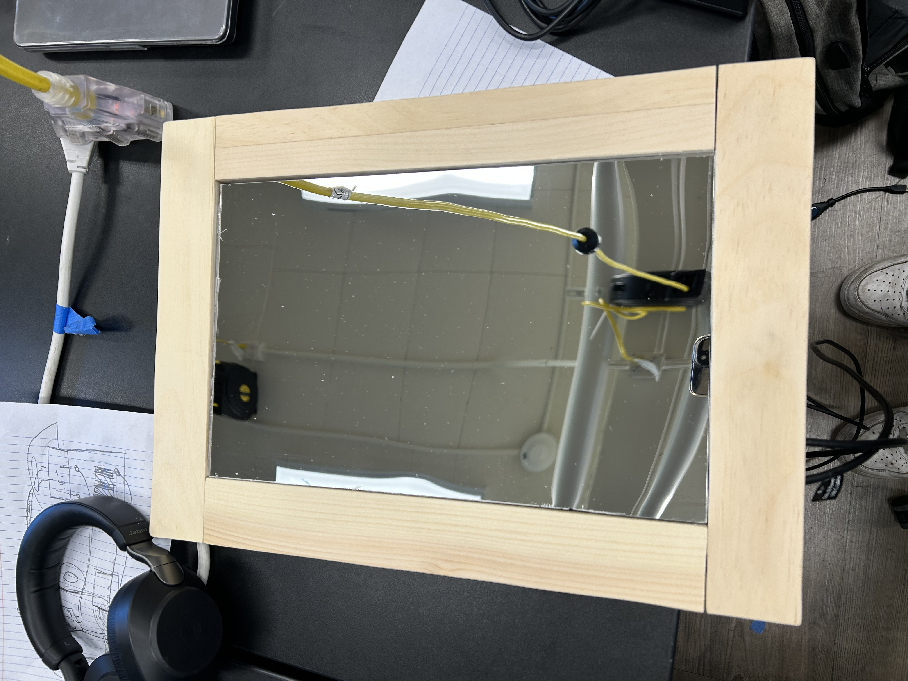
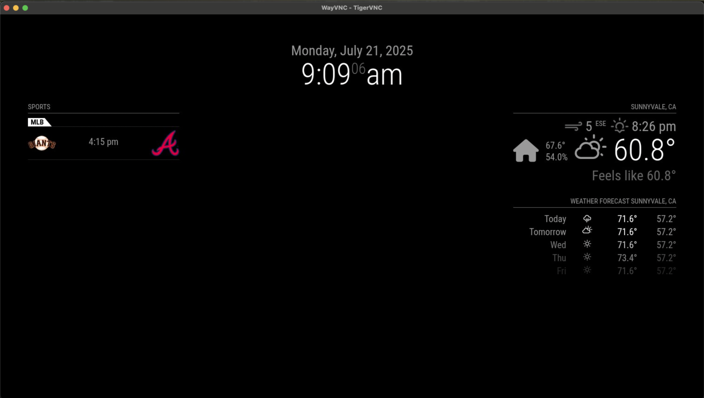
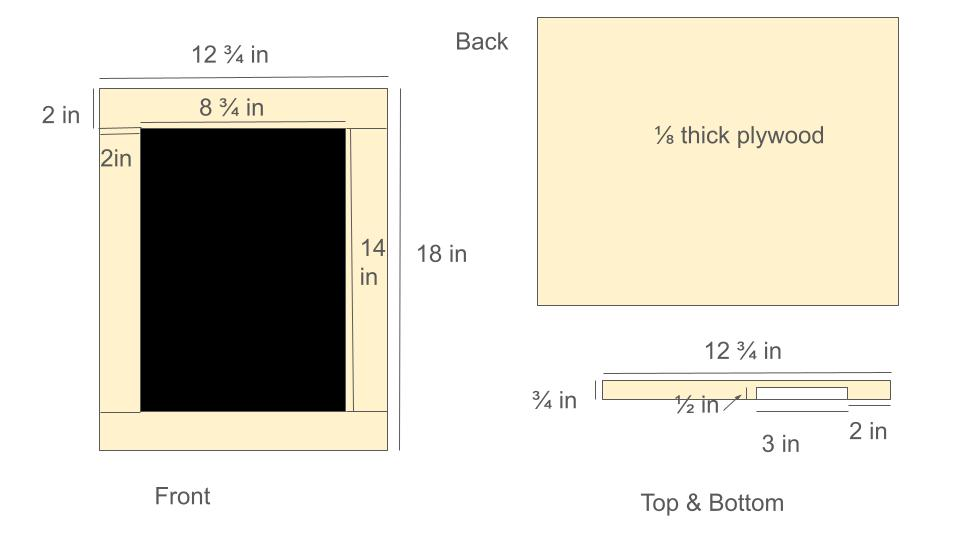
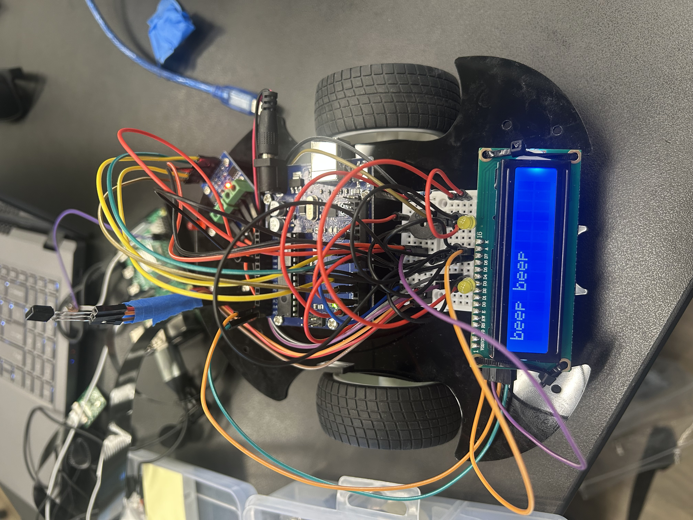

# Smart Mirror & RC Car
For my projects I am building a smart mirror than runs using a Raspberry Pi and a RC car that can be controlled by an IR remote. 

The mirror displays information like time, weather, and news to the user. The mirror runs software that allows for modules to be displayed onto the Magic Mirror. These modules use APIs to recieve the information that is displayed and can be downloaded off the internet. 

The RC car runs off of an arduino which is connected to the IR detector. The IR detector tells the arduino to move the car along with controlling the different features of the car.

| **Engineer** | **School** | **Area of Interest** | **Grade** |
|:--:|:--:|:--:|:--:|
| Ben F | Homestead | Mechanical Engineering | Incoming Junior

 
  

# Final Milestone

<iframe width="560" height="315" src="https://www.youtube.com/embed/k0fNvQZznik?si=ugAOPbBwC46I7eV7" title="YouTube video player" frameborder="0" allow="accelerometer; autoplay; clipboard-write; encrypted-media; gyroscope; picture-in-picture; web-share" referrerpolicy="strict-origin-when-cross-origin" allowfullscreen></iframe>

For my last milestone, I was able to design assemble my Smart Mirror. To do this I first examined the mirror frame I was given and the monitor I was given. When examining these parts I realized that there was no way to be able to fit the monitor in the the frame without modifications. To fit the montior, I first drilled holes into plywood to match the four mounting screws that the monitor had. Then using these holes I screwed the monitor into the the plywood. I then cut out two slices of plywood to the right and left of the monitor so that the IO ports and the buttons to adjust the monitor could be accessed and not trapped behind the plywood when the mirror was fully assembled. After doing that, since the monitor and plywood were thicker than the mirror something would be needed to mount the plywood a little bit behind the frame of the mirror. To solve this problem I used CAD to design two types of mounting brackets. (Figures 1 & 2)


However, when I tried to assemble this I found out that the frame was to brittle to hold the screws in meaning that I would have to find a new way to assemble my mirror. So I decided to make my own frame using wood. I decided that the mirror would have a 2 inch thick frame and be around 1 inch thick. The frame would be made out of pine wood that I would cut and it would be backed by a large sheet of plywood to hold it together. I cut the wood from a large plank into some smaller 1x2 planks using a jigsaw, then using the same jigsaw I cut two divots into the top and bottom so that IO could be accessed. Then I used sandpaper to smooth out the divots. After that I used wood glue to connect the 1x2 planks to the plywood backboard. (Figure 4)


After the glue had dried, I used sandpaper to smooth out the edges of my mirror. Then, I used double sided Gorilla tape to mount the monitor inside my mirror's frame. After that, using a XACTO knife, I cut the reflective vinyl to the dimensions of my monitor so that it could fit inside the frame. Then using the same double sided Gorilla tape, I taped the vinyl to the edges of the monitor.

In addition to assembling the mirror, I added a custom module to display the sports games that will occur and a module to measure the temperature and humidity of the surrounding environment. While installing the sports module, I had trouble getting it to display on the mirror. I tried debugging it with multiple different methods, including reinstalling the module. However, I realized that the module was an outdated version and that I needed to download the up to date version from a different Github repository. After downloading and installing this up to date version of the module, the module was able to be displayed on the mirror. 

To add the temperature module, I wired up a DHT11 sensor, which measures temperature and humidity, to my raspberry pi (Figure 3). To do this I used an online pinout diagram for my raspberry pi. After connecting the DHT11, I downloaded the the Adafruit DHT library so that the sensor could properly function. Then, I installed a custom module so that the MagicMirror program could process the data coming from the sensor. However, when I tested the sensor for the first time, the temperature reading was off by around 50 degrees. To fix this, I went into the code of the module, subtracting 50 degrees from the temperature value that the module produces.




# Second Milestone

<iframe width="560" height="315" src="https://www.youtube.com/embed/Ped76qk6baw?si=1Jdb2bB7wO4eIcqL" title="YouTube video player" frameborder="0" allow="accelerometer; autoplay; clipboard-write; encrypted-media; gyroscope; picture-in-picture; web-share" referrerpolicy="strict-origin-when-cross-origin" allowfullscreen></iframe>

For my second milestone, I was able to get the Magic Mirror code running on my Raspberry Pi. To do this I followed the documentation for the Magic Mirror. First downloading Node onto the Raspberry Pi. Then, I cloned the Magic Mirror repository onto the Pi and entering it with the cd command. However, when I went to install the program it gave me an error stating that my Node version was not correct. I then went online to find out how to update my Node version to the correct version. I followed the online instructions to update it. After that, The program was able to be installed onto the Pi. I then ran the program on the Pi to find out that I would like to change how it is configured to give me the correct weather and time for San Jose. I went back into the documentation to find out how to change these and used Visual Studio Code to edit the code so that it would display the correct information. Before I complete my final milestone, I need to assemble my mirror, connect it to the Raspberry Pi, and make sure that the code runs without problems on it.


Magic Mirror Code running on the Raspberry Pi viewed through Tiger VNC


# First Milestone

<iframe width="560" height="315" src="https://www.youtube.com/embed/lR03E-XPhus?si=wNX5nMR3U7F3m0Tk" title="YouTube video player" frameborder="0" allow="accelerometer; autoplay; clipboard-write; encrypted-media; gyroscope; picture-in-picture; web-share" referrerpolicy="strict-origin-when-cross-origin" allowfullscreen></iframe>

My project is a smart mirror that runs on Raspberry Pi which runs the code to display time, weather, and news. At this milestone, I was able to get the Raspberry Pi running. To get it to run, I first connected it to a capture card which streamed the screen output of the Raspberry Pi to my laptop using OBS, a streaming software which lets me stream the Pi to my computer. With this, I was able to change the settings of the Pi so that ssh could be used. We use ssh so that we can work on the Raspberry Pi while still using our computer. After doing that, I returned to my laptop and pinged the Pi in the Terminal and then used the ssh command to connect to it. Then, I used Tiger VNC to remotely view and control my Raspberry Pi without needing to use the capture card. Finally, I installed Visual Studio Code to code on my computer and send it to the Raspberry Pi. A challenge I faced was that I had forgotten the password to my Raspberry Pi so I needed assistance to reset it. I plan to complete the project by first coding the Raspberry Pi and then assembling my mirror.


Raspberry Pi being accessed and controled from my computer

# Schematics 

Figure 1 & 2: Corner & Side Mounting Bracket

 

Figures 1 & 2:
The thickness of the monitor attached to the plywood backboard is greater than that of the frame. So I had to design some brackets to mount the backboard montior assembly to be back of the frame. Both types of brackets are 3cm by 3cm squares that are 0.6cm thick. There is a 0.2cm cut into the brackets for the plywood to slide into. The cut leaves 1cm where the brackets would overlap with the frame to allow for mounting the brackets to the frame with a screw.

Figure 3: DHT11 Temperature Sensor wiring diagram


Figure 4: MagicMirror Frame Diagram




# Code

This is how I have configured my MagicMirror:
```js
et config = {
	address: "localhost",	// Address to listen on, can be:
							// - "localhost", "127.0.0.1", "::1" to listen on loopback interface
							// - another specific IPv4/6 to listen on a specific interface
							// - "0.0.0.0", "::" to listen on any interface
							// Default, when address config is left out or empty, is "localhost"
	port: 8080,
	basePath: "/",	// The URL path where MagicMirror² is hosted. If you are using a Reverse proxy
									// you must set the sub path here. basePath must end with a /
	ipWhitelist: ["127.0.0.1", "::ffff:127.0.0.1", "::1"],	// Set [] to allow all IP addresses
									// or add a specific IPv4 of 192.168.1.5 :
									// ["127.0.0.1", "::ffff:127.0.0.1", "::1", "::ffff:192.168.1.5"],
									// or IPv4 range of 192.168.3.0 --> 192.168.3.15 use CIDR format :
									// ["127.0.0.1", "::ffff:127.0.0.1", "::1", "::ffff:192.168.3.0/28"],

	useHttps: false,			// Support HTTPS or not, default "false" will use HTTP
	httpsPrivateKey: "",	// HTTPS private key path, only require when useHttps is true
	httpsCertificate: "",	// HTTPS Certificate path, only require when useHttps is true

	language: "en",
	locale: "en-US",   // this variable is provided as a consistent location
			   // it is currently only used by 3rd party modules. no MagicMirror code uses this value
			   // as we have no usage, we  have no constraints on what this field holds
			   // see https://en.wikipedia.org/wiki/Locale_(computer_software) for the possibilities

	logLevel: ["INFO", "LOG", "WARN", "ERROR"], // Add "DEBUG" for even more logging
	timeFormat: 12,
	units: "imperial",

	modules: [
		{
			module: "alert",
		},
		{
			module: "clock",
			position: "top_bar",
			config: {
				timeFormat: "12",
				timezone: "America/Los_Angeles"
			},
		},
		{
			module: "weather",
			position: "top_right",
			config: {
				weatherProvider: "weathergov",
				type: "current",
				lat: 37.3688,
				lon: -122.0363,
				showIndoorTemperature: true,
				showIndoorHumidity: true,
			}
		},
		{
			module: "weather",
			position: "top_right",
			header: "Weather Forecast",
			config: {
				weatherProvider: "weathergov",
				type: "forecast",
				lat: 37.3688,
				lon: -122.0363
			}
		},
		{
			module: "newsfeed",
			position: "bottom_bar",
			config: {
				feeds: [
					{
						title: "New York Times",
						url: "https://rss.nytimes.com/services/xml/rss/nyt/HomePage.xml",
						broadcastNewsFeeds: true,
					}
				],
				showSourceTitle: true,
				showPublishDate: true,
				broadcastNewsFeeds: true,
				broadcastNewsUpdates: true
			}
		},
		{
			module: "MMM-MyScoreboard",
			position: "top_left",
			classes: "default everyone",
			header: "Sports",
			config: {
				showLeagueSeparators: true,
				colored: true,
				viewStyle: "largeLogos",
				sports: [
				{
					league: "NBA",
					teams: ["GSW"],
					groups: ["West"]
				},
				{
					league: "MLB",
					teams: ["SF"]
				},
				{
					league: "NFL",
					teams: ["SF"],
					groups: ["NFC West"]
				}
				]

			}
		},
		{
			module: "MMM-DHT-Sensor",
			config:{
				sensorPin: 2,
				sensorType: 11,
				units: "imperial",
				updateInterval: 0.5,
			}
		},
	]
};

<!---/*************** DO NOT EDIT THE LINE BELOW ***************/
if (typeof module !== "undefined") { module.exports = config; }
```
Downloading MagicMirrorOS:
1. Download Node.js
2. Execute ```git``` to check if git is install, install it if it isn't already
3. Clone the MagicMirror repostitory by running ```git clone https://github.com/MagicMirrorOrg/MagicMirror```
4. Enter the MagicMirror respostory with ```cd MagicMirror```
5. Install MagicMirrorOS with ```npm run install-mm```
6. Copy the config sample file ```cp config/config.js.sample config/config.js```
7. Start MagicMirrorOS with ```npm run start```

Custom Modules I installed:

<a href="https://github.com/dathbe/MMM-MyScoreboard"> MMM-MyScoreboard </a>

<a href="https://github.com/glitch452/MMM-LocalTemperature"> MMM-LocalTemperature </a>

# Bill of Materials

| **Part** | **Note** | **Price** | **Link** |
|:--:|:--:|:--:|:--:|
|CanaKit Raspberry Pi 4 4GB Starter PRO Kit | Running MagicMirrorOS | $139.99 | <a href="https://a.co/d/fWeGlak"> Link </a> |
| 15.6’’ FHD IPS Portable Monitor | Displays MagicMirrorOS to the user | $81.99 | <a href="https://a.co/d/0VFRcFx"> Link </a> |
| Anker New Nylon USB C to USB C Cable (6ft 60W, 2-Pack) | Cables to power the Raspberry Pi and Monitor | $12.99 | <a href="https://a.co/d/dEYt4i2"> Link </a> |
| Nekmit Dual Port USB C Wall Charger, 40W PD | Powers Raspberry Pi and Monitor | $26.99 | <a href="https://a.co/d/g5ZpG17"> Link </a> |
| 12 x 18 x 0.04 Inch Acrylic See-Through Mirror | Shows a reflection while letting light pass through | $29.99 | <a href="https://a.co/d/3HWUPE6"> Link </a> |
| 6 Pack Basswood Sheets for Crafts 1/8x12x18 | Backboard for the mirror assembly | $19.99 | <a href="https://a.co/d/7VZWMLw"> Link </a> |
| Edge-glued Board by Walnut Hollow, Pine, 12" x 16" x 3/4" | Wood to assemble frame with | $19.50 | <a href="https://a.co/d/bsTsKR3"> Link </a> |
| Gorilla Heavy Duty Double Sided Mounting Tape, Black Tape, 1" x 120" | Assembling Smart Mirror | $12.24 | <a href="https://a.co/d/elYowfY"> Link </a> |

# RC Car

My RC car runs off of an ardunio connected to an IR sensor. This sensor receives commands from a remote which tells the ardunio what to do. Besides from driving, the car can make beeping noises, has attached lights that can turn on and off, and can display messages on a screen.



To assemble the car I first followed the online instructions provided in the car kit, attaching the motors, the motor controller module, the arduino, the wheels, battery, and finally connecting it all together. After the basic parts of the car were attached, I downloaded arduino IDE onto my computer and connected the ardunio to arduino IDE. I then imported the IR library so that the car could work. Then I copied the basic code that allows the remote to control the car. This code uses a loop with a set of if statements to constantly recieve and process inputs from the remote

The first thing that I added to the car were four lights that could be toggled on and off by the remote. To power the lights, I connected them to 5V power through a resistor, then from there I connected the four lights to it. I mounted two of the lights in the breadboard up in the front of the car and mounted two of them in the back, using holes that were in the frame of the car. Then I modified the code by adding an extra if else statement to the main if loop, which calls a method with an int value of -1. In that method, the int value is mulitpied with a field variable of 1 or -1, then based on that value the method uses an if statement to determine weather to turn the lights on or off.

I then added a buzzer to the car. To control the buzzer I three new if statements that call three new methods, each that makes a different pattern of beeps. When I was programming this, an issue came up in which the buzzer would disable the main if loop when the buzzer method was called. After I tried to debug this in multiple ways, I found out that it was because of a conflict in the timer of the arduino. I found out that the IR reciever and the buzzer would both try to use the same timer, causing the IR module to shut off when the buzzer method was called. To fix this, I had the the buzzer methods pause the IR reciever's timer before the buzzer was activated and resume the timer when the buzzer stopped.

Finally, I added an ICD screen to the car so that the car can display messages. I connected this screen to the analog inputs on the arduino and the 5V power and used zip ties to mount the screen onto the car. I then installed the LiquidCrystal library and imported it into the program. Then I intialized the ICD and turned on the backlight with code. Then using the existing buzzer methods, I had the screen display a message whenever the buzzer was pressed. However, when another method that prints a different method was called the previous text would still remain depending on the length of the text. To fix this, I researched about the lcd, finding out that the ```clear()``` method could be called which would clear the LCD screen.

# Car Code

```c++
#include <IRremote.h>
#include <Wire.h>
#include <LiquidCrystal_I2C.h>

const int IR_RECEIVE_PIN = 12;  // Define the pin number for the IR Sensor
LiquidCrystal_I2C lcd(0x27, 16, 2);
const int A_1B = 5;
const int A_1A = 6;
const int B_1B = 9;
const int B_1A = 10;
const int LIGHTS = 2;
constexpr int BUZZ = 3;


int speed = 150;
int onOff = -1;

void setup() {
  Serial.begin(9600);

  //motor
  pinMode(A_1B, OUTPUT);
  pinMode(A_1A, OUTPUT);
  pinMode(B_1B, OUTPUT);
  pinMode(B_1A, OUTPUT);
  pinMode(LIGHTS, OUTPUT);
  pinMode(BUZZ, OUTPUT);
  lcd.init();  //initialize the lcd
  lcd.backlight();  //open the backlight

  //IR remote
  IrReceiver.begin(IR_RECEIVE_PIN, ENABLE_LED_FEEDBACK);  // Start the IR receiver // Start the receiver
  Serial.println("REMOTE CONTROL START");

}

void loop() {

  if (IrReceiver.decode()) {
    //    Serial.println(results.value,HEX);
    String key = decodeKeyValue(IrReceiver.decodedIRData.command);
    if (key != "ERROR") {
      Serial.println(key);

      if (key == "+") {
        speed += 50;
      } else if (key == "-") {
        speed -= 50;
      } else if (key == "2") {
        moveForward(speed);
        delay(1000);
      } else if (key == "1") {
        moveLeft(speed);
      } else if (key == "3") {
        moveRight(speed);
      } else if (key == "4") {
        turnLeft(speed);
      } else if (key == "6") {
        turnRight(speed);
      } else if (key == "7") {
        backLeft(speed);
      } else if (key == "9") {
        backRight(speed);
      } else if (key == "8") {
        moveBackward(speed);
        delay(1000);
      } else if ( key == "POWER"){
        lights(-1);
      } else if ( key == "PLAY/PAUSE"){
        buzzer();
        Serial.println("exited");
      } else if ( key == "BACKWARD"){
        buzzer2();
        Serial.println("exited");
      } else if ( key == "FORWARD"){
        buzzer3();
        Serial.println("exited");
      }

      if (speed >= 255) {
        speed = 255;
      }
      if (speed <= 0) {
        speed = 0;
      }
      delay(500);
      stopMove();
    }

    IrReceiver.resume();  // Enable receiving of the next value
  }
}

void lights(int num){
  onOff = (onOff*num);
  if (onOff == 1){
    digitalWrite(LIGHTS, 1);
    lcd.setCursor(1, 0);
  }
  else{
    digitalWrite(LIGHTS, 0);
    lcd.setCursor(1, 0);
  }
}
void buzzer(){
  lcd.setCursor(1, 0);
  lcd.clear();
  lcd.print("beep beep");
  IrReceiver.stopTimer();
  tone(BUZZ, 500, 1000);
  delay(1000);
  IrReceiver.restartTimer();
}
void buzzer2(){
  lcd.setCursor(1, 0);
  lcd.clear();
  lcd.print("1v1 on clash");
  IrReceiver.stopTimer();
  tone(BUZZ, 500, 250);
  delay(300);
  tone(BUZZ, 500, 250);
  delay(300);
  tone(BUZZ, 500, 250);
  delay(300);
  tone(BUZZ, 500, 250);
  delay(300);
  tone(BUZZ, 500, 250);
  delay(300);
  tone(BUZZ, 500, 250);
  delay(300);
  IrReceiver.restartTimer();
}

void buzzer3(){
  lcd.setCursor(1, 0);
  lcd.clear();
  lcd.print("let me play");
  lcd.setCursor(0, 1);
  lcd.print("clash pls");
  IrReceiver.stopTimer();
  tone(BUZZ, 500, 250);
  delay(300);
  tone(BUZZ, 500, 250);
  delay(600);
  tone(BUZZ, 500, 250);
  delay(300);
  tone(BUZZ, 500, 250);
  delay(600);
  tone(BUZZ, 500, 250);
  delay(300);
  tone(BUZZ, 500, 250);
  delay(300);
  IrReceiver.restartTimer();
}

void moveForward(int speed) {
  lcd.clear();
  analogWrite(A_1B, 0);
  analogWrite(A_1A, speed);
  analogWrite(B_1B, speed);
  analogWrite(B_1A, 0);
}

void moveBackward(int speed) {
  lcd.clear();
  analogWrite(A_1B, speed);
  analogWrite(A_1A, 0);
  analogWrite(B_1B, 0);
  analogWrite(B_1A, speed);
}

void turnRight(int speed) {
  lcd.clear();
  analogWrite(A_1B, speed);
  analogWrite(A_1A, 0);
  analogWrite(B_1B, speed);
  analogWrite(B_1A, 0);
}

void turnLeft(int speed) {
  lcd.clear();
  analogWrite(A_1B, 0);
  analogWrite(A_1A, speed);
  analogWrite(B_1B, 0);
  analogWrite(B_1A, speed);
}

void moveLeft(int speed) {
  lcd.clear();
  analogWrite(A_1B, 0);
  analogWrite(A_1A, speed);
  analogWrite(B_1B, 0);
  analogWrite(B_1A, 0);
}

void moveRight(int speed) {
  lcd.clear();
  analogWrite(A_1B, 0);
  analogWrite(A_1A, 0);
  analogWrite(B_1B, speed);
  analogWrite(B_1A, 0);
}

void backLeft(int speed) {
  lcd.clear();
  analogWrite(A_1B, speed);
  analogWrite(A_1A, 0);
  analogWrite(B_1B, 0);
  analogWrite(B_1A, 0);
}

void backRight(int speed) {
  lcd.clear();
  analogWrite(A_1B, 0);
  analogWrite(A_1A, 0);
  analogWrite(B_1B, 0);
  analogWrite(B_1A, speed);
}

void stopMove() {
  analogWrite(A_1B, 0);
  analogWrite(A_1A, 0);
  analogWrite(B_1B, 0);
  analogWrite(B_1A, 0);
}


String decodeKeyValue(long result)
{
  switch(result){
    case 0x16:
      return "0";
    case 0xC:
      return "1"; 
    case 0x18:
      return "2"; 
    case 0x5E:
      return "3"; 
    case 0x8:
      return "4"; 
    case 0x1C:
      return "5"; 
    case 0x5A:
      return "6"; 
    case 0x42:
      return "7"; 
    case 0x52:
      return "8"; 
    case 0x4A:
      return "9"; 
    case 0x9:
      return "+"; 
    case 0x15:
      return "-"; 
    case 0x7:
      return "EQ"; 
    case 0xD:
      return "U/SD";
    case 0x19:
      return "CYCLE";         
    case 0x44:
      return "PLAY/PAUSE";   
    case 0x43:
      return "FORWARD";   
    case 0x40:
      return "BACKWARD";   
    case 0x45:
      return "POWER";   
    case 0x47:
      return "MUTE";   
    case 0x46:
      return "MODE";       
    case 0x0:
      return "ERROR";   
    default :
      return "ERROR";
    }
}
```

# Starter Project

<iframe width="560" height="315" src="https://www.youtube.com/embed/HlC0FD95Rxc?si=TMSMpwka0znPHmGE" title="YouTube video player" frameborder="0" allow="accelerometer; autoplay; clipboard-write; encrypted-media; gyroscope; picture-in-picture; web-share" referrerpolicy="strict-origin-when-cross-origin" allowfullscreen></iframe>

For my starter project I made a retro arcade console which plays Tetris. It works by connecting components with a circuit board. These components are buttons, a screen, an on off toggle, and a battery pack. To attach these components onto the main board, I used a soldering iron to solder the components on. Some challenges that I faced while making this learning how to soder and sodering on the USB port the wrong way around.


